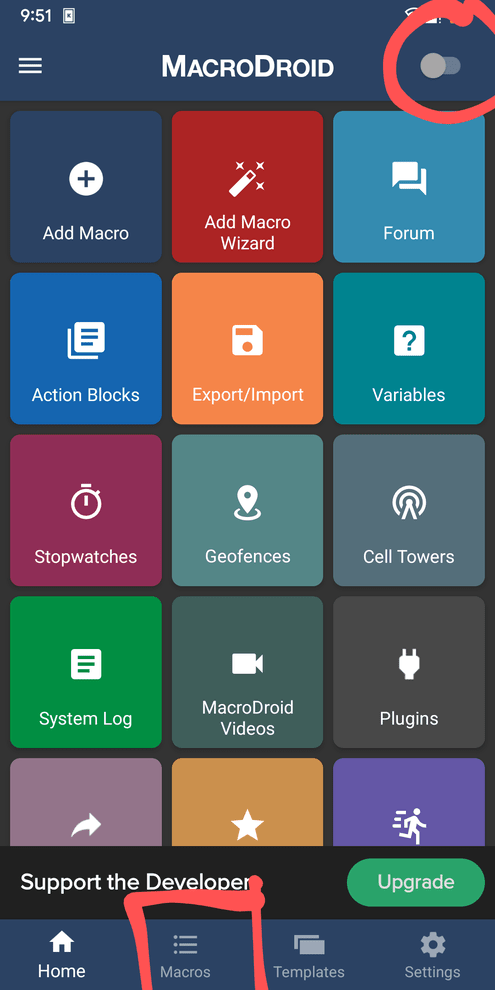

# watch_commands
Execute shell commands on your Linux computer from your smartwatch!

As seen on reddit:
<https://www.reddit.com/r/unixporn/comments/zpkobz/galaxy_watch_4_running_commands_from_my_watch/?utm_source=share&utm_medium=web2x&context=3>

Here I am launching shell scripts from smartwatch to my Linux using a combination of KDEConnect and MacroDroid.
Here is a guide for setting it up.

Launching scripts from an android device to a linux machine is fairly straightfoward, so I will explain that first. 
You can check out this github repository on how to get started with KDEConnect
<https://github.com/jrodal98/watch-scripts>

Here I am using Xmonad WM, you can use any other distro or WM but the shell command changes.

# Launching Scripts
Now after setting up KDEConnect you can see that you can control your linux with your smartphone.
Since we need to run it from our watch and kde support for Wear OS is not there, we can use an app called MacroDroid which is free of cost unlike Tasker as showed in the previous post.

- Download [<ins>**MacroDroid**</ins>](https://play.google.com/store/apps/details?id=com.arlosoft.macrodroid&gl=US&pli=1) from PlayStore
- For each KDEConnect Command 
  1) Copy the Command URL by pressing and holding the command as shown
  2) Now paste the command in [TinyURL](https://tinyurl.com/app) (MacroDroid requires in the form of a web link | You can use any URL shortener depending on your choice)
  3) Now copy the TinyURL shortened link.
- Open [**MacroDroid**](https://play.google.com/store/apps/details?id=com.arlosoft.macrodroid&gl=US&pli=1)
- Enable MacroDroid and go to Macros

