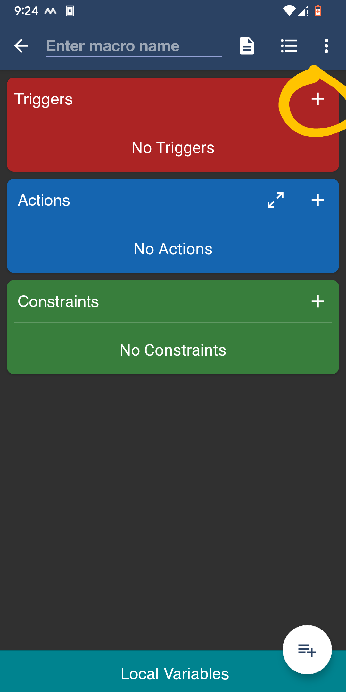
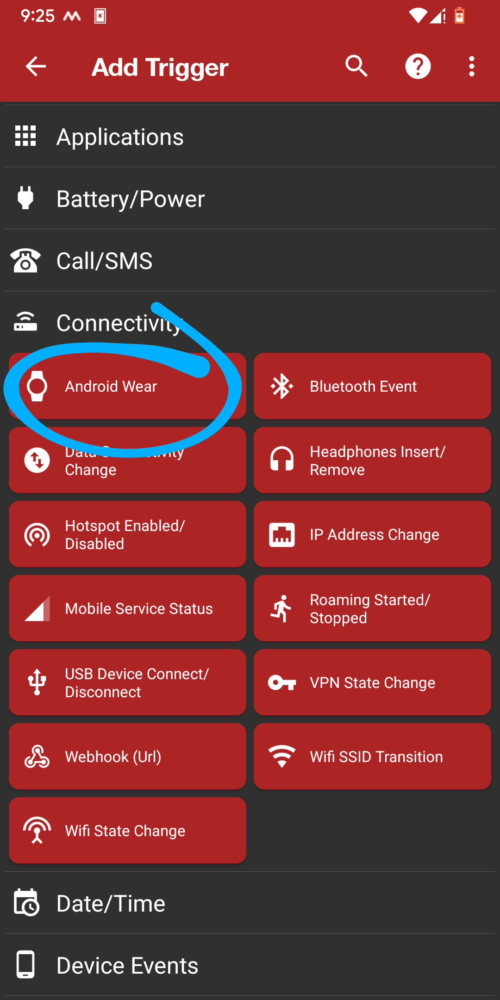
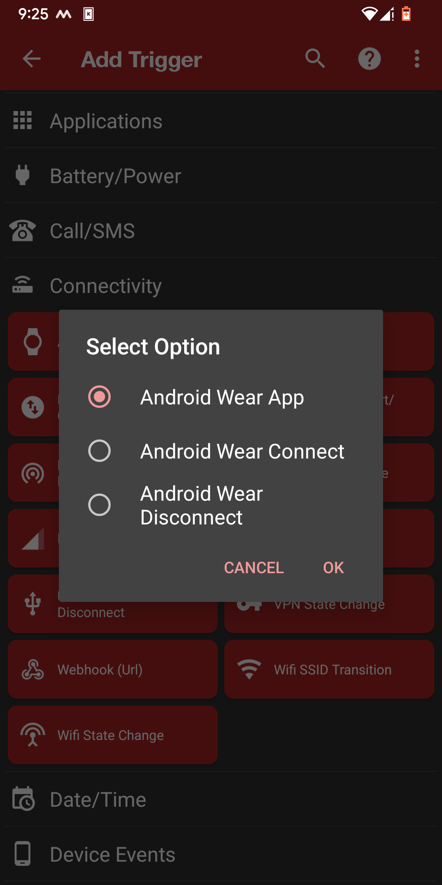
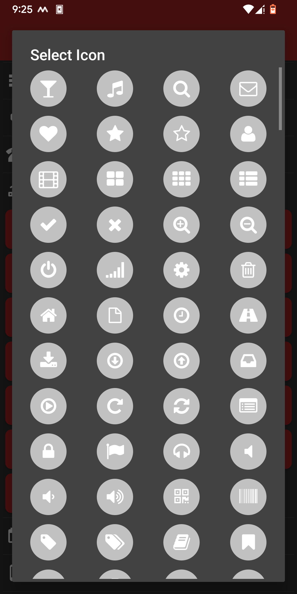
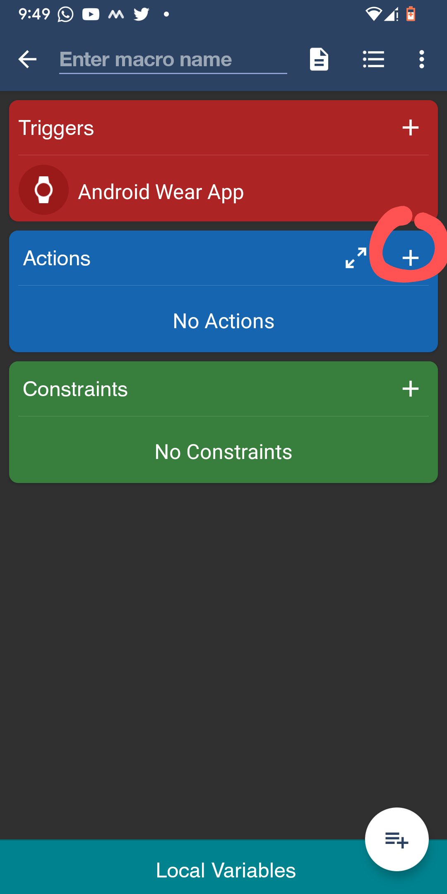
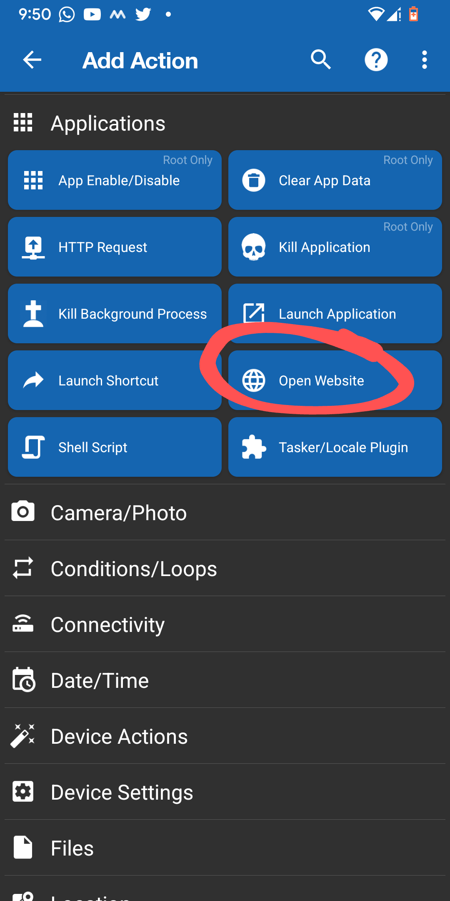
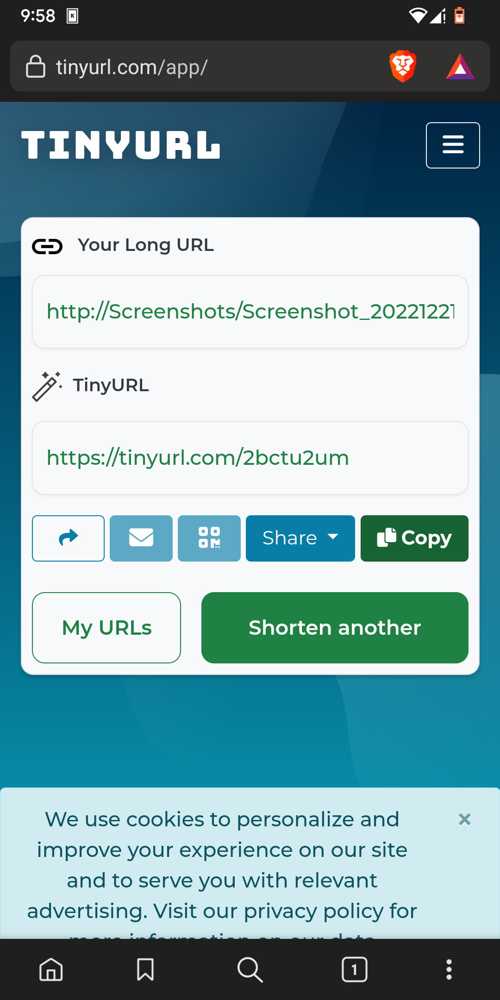
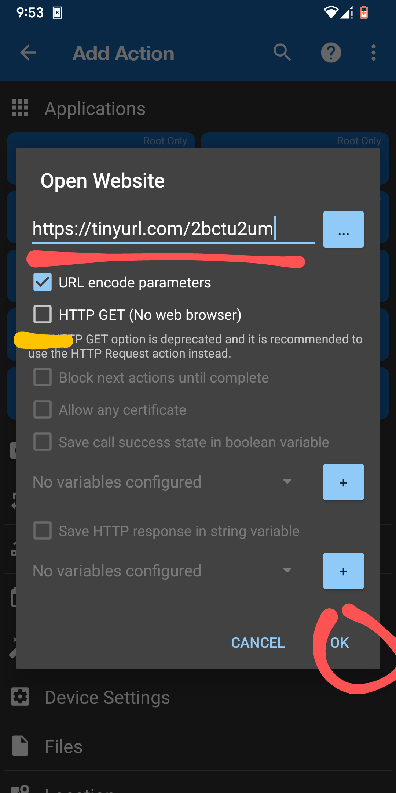
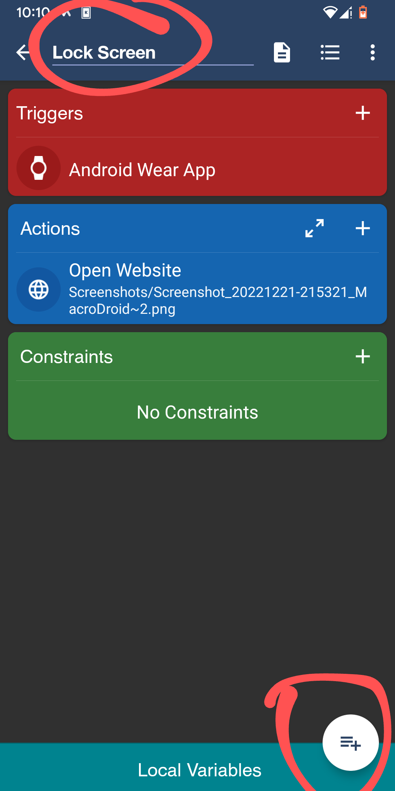

# watch_commands
Execute shell commands on your Linux computer from your smartwatch!

As seen on reddit:
<https://www.reddit.com/r/unixporn/comments/zpkobz/galaxy_watch_4_running_commands_from_my_watch/?utm_source=share&utm_medium=web2x&context=3>

Here I am launching shell scripts from smartwatch to my Linux using a combination of KDEConnect and MacroDroid.
Here is a guide for setting it up.

Launching scripts from an android device to a linux machine is fairly straightfoward, so I will explain that first. 
You can check out this github repository on how to get started with KDEConnect
<https://github.com/jrodal98/watch-scripts>

Here I am using Xmonad WM, you can use any other distro or WM but the shell command changes.

# Launching Scripts
Now after setting up KDEConnect you can see that you can control your linux with your smartphone.
Since we need to run it from our watch and kde support for Wear OS is not there, we can use an app called MacroDroid which is free of cost unlike Tasker as showed in the previous post.

- Download [<ins>**MacroDroid**</ins>](https://play.google.com/store/apps/details?id=com.arlosoft.macrodroid&gl=US&pli=1) from PlayStore
- For each KDEConnect Command 
  1) Copy the Command URL by pressing and holding the command as shown
  2) Now paste the command in [TinyURL](https://tinyurl.com/app) (MacroDroid requires in the form of a web link | You can use any URL shortener depending on your choice)
  3) Now copy the TinyURL shortened link.
- Open [**MacroDroid**](https://play.google.com/store/apps/details?id=com.arlosoft.macrodroid&gl=US&pli=1)
- Enable MacroDroid and go to Macros

- Enable Uncategorized and Click on the ➕ icon.

- Now in the <ins>**Triggers**</ins> Section click on the ➕ icon.

- In the <ins>**Connectivity**</ins> section click on ⌚**Android Wear** and in that select **Android Wear App** and click OK.
- You'll find a list of icon, depending on the command you are going to put you can select the icon you want. For example my first command is to **Lock screen** then I would select 🔒lock icon.

- After that you can go back and you'll reach the below screen again

- Now click on the ➕ icon in the Action section.
- Go to the **Applications** section and click on 🌐**Open Website**.
- Copy the **TinyURL** link you made previously where you pasted the kdeconnect url.
- Copy the link and paste as shown below.
- Make sure HTTP GET is disabled as it opens browser to run the command and click on OK.
- The disadvantage of this is everytime you run the command in your Smartwatch your phone should be on and browser redirects to your kdeconnect app for it to work.
- I am finding a way to get it directly only in notifications and will update here as well.Any inputs would be appreciated.

- Now you can type the name you want and click on the icon to save it.
- And that's it, you are done. Enjoy operating Linux through your watch!

